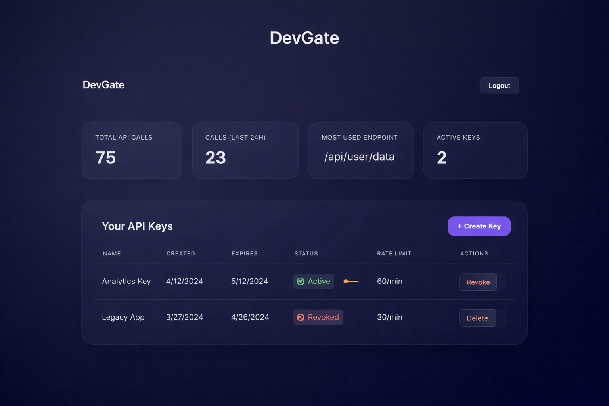
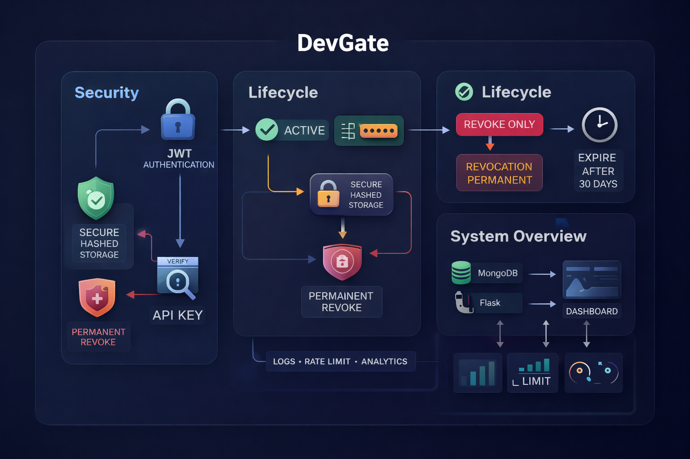

# 🔐 DevGate — API Key Management Platform

A secure, multi-tenant **API Key Management SaaS backend** built using **Flask + MongoDB**, focused on authentication, key lifecycle control, rate limiting, and analytics.

This project simulates a real-world developer platform where users can generate, manage, revoke, and monitor API keys securely.

---

## 📌 Project Overview

**DevGate** provides a production-style API key management system with proper JWT authentication, hashed key storage, expiration handling, rate limiting, logging, and analytics.

The platform is designed to be:

- 🔐 **Secure** — Hashed API keys, JWT auth, revoke-only model  
- 📊 **Observable** — Usage logs & analytics endpoints  
- ⚙️ **Scalable in structure** — Clean blueprint-based backend architecture  
- 💼 **Recruiter-grade** — Mirrors real SaaS backend patterns  

It demonstrates practical backend engineering concepts used in real API platforms.

---

## 🎯 Key Features

- 🔑 API key generation (secure random keys)
- 🚫 Permanent key revocation (non-reversible)
- ⏳ Expiration control
- 🚦 Rate limiting per key
- 📈 Usage analytics (total calls, 24h usage, most-used endpoint)
- 📝 API request logging
- 👤 Multi-user JWT authentication
- 💻 Modern SaaS-style dashboard (HTML/CSS/JS)

---

## 🛠️ Tech Stack

- **Backend:** Flask (App Factory Pattern)
- **Database:** MongoDB
- **Auth:** JWT (Header-based)
- **Frontend:** HTML, CSS (Glass UI), Vanilla JS
- **Tools:** Git, VS Code

---

## 📂 Project Structure

```text
devgate/
│
├── app/
│   ├── routes/
│   ├── models/
│   ├── templates/
│   ├── static/
│   └── __init__.py
│
├── run.py
├── requirements.txt
└── README.md
```

---

## ⚙️ How to Run Locally

- 1️⃣ Clone repository
     - git clone https://github.com/prathmesh2507/API-Key-Management-Platform.git
     - cd devgate

- 2️⃣ Install dependencies
     - pip install -r requirements.txt

- 3️⃣ Start server
     - python run.py

- Visit: http://127.0.0.1:5000
---

## 📸 Screenshots
---
### Dashboard


### Architecture Overview


---

## 🧠 Engineering Highlights
-Secure key lifecycle design (revoke-only policy)
-Clean separation using Blueprints
-ISO datetime serialization for frontend safety
-Defensive JS architecture with null guards
-Confirmation modals for destructive actions

---

## 🤝 Contributing
- Suggestions and improvements are always welcome 🙌
- Feel free to fork the repository or open an issue for enhancements or bug fixes.

---

## 📫 Connect With Me
- 💻 **GitHub**: https://github.com/prathmesh2507
- 💻 **Linkedin**: https://linkedin.com/in/prathmesh-bhoyar-24b0b0310

---

## ⭐ Support
- If you found this project useful, consider giving it a star ⭐ —it really helps and motivates me to keep building!
